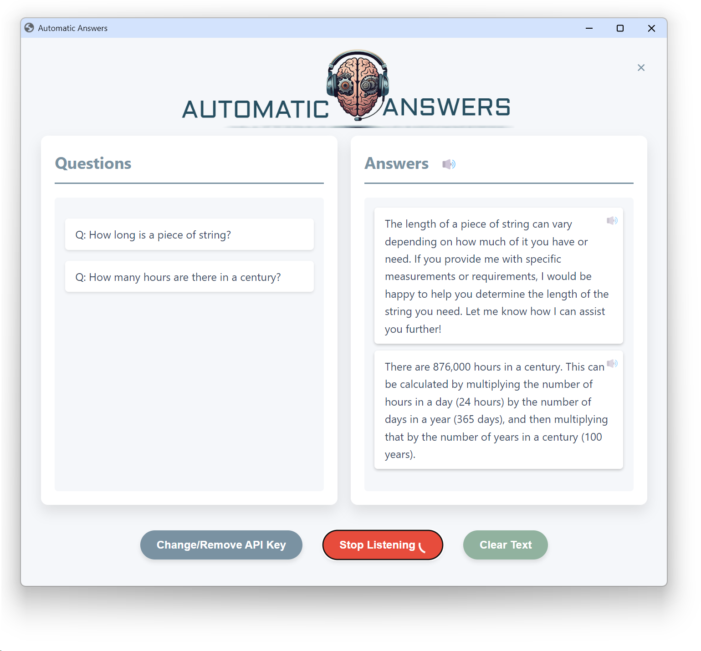

# AI-Powered Interview Assistant


> 🎤 A voice-enabled AI interview preparation assistant powered by Google Gemini that listens to interview questions, converts speech to text, and generates intelligent responses in real time.

---

## 📸 Application Preview



---

## 🚀 Overview

AI-Powered Interview Assistant is a desktop-based interview preparation application built using Python, Eel, SpeechRecognition, and Google's Gemini AI.

The application captures interview questions through the microphone, converts speech into text, processes the query using Gemini AI, and displays intelligent responses through an interactive user interface.

This project demonstrates practical integration of:

* Speech Recognition
* Generative AI
* Frontend-Backend Communication
* Desktop Application Development
* API Integration

---

## ✨ Features

### 🎤 Voice-Based Question Input

* Real-time speech recognition
* Automatic question detection
* Continuous listening mode

### 🤖 AI-Powered Responses

* Powered by Google Gemini AI
* Instant response generation
* Context-aware answers

### 🖥️ Interactive Desktop Interface

* Built using Eel
* Clean and responsive UI
* Real-time question and answer display

### 🔐 API Key Management

* Secure Gemini API integration
* Local configuration storage
* Easy API key updates

### ⚡ Performance

* Lightweight architecture
* Fast response generation
* Low system resource usage

---

## 🏗️ Project Architecture

```text
Microphone Input
       │
       ▼
Speech Recognition
       │
       ▼
Question Detection
       │
       ▼
Google Gemini API
       │
       ▼
Response Generation
       │
       ▼
Desktop User Interface
```

---

## 🛠️ Tech Stack

### Backend

* Python 3.12+
* Google Gemini API
* SpeechRecognition
* Eel

### Frontend

* HTML5
* CSS3
* JavaScript

### AI Model

* Gemini Flash

---

## 📂 Project Structure

```text
AI-Powered-Interview-Assistant/
│
├── web/
│   ├── index.html
│   ├── script.js
│   ├── styles.css
│   ├── answers.png
│   └── OpenAI_Logo.png
│
├── inter_ass.py
├── screenshot.png
├── README.md
├── .gitignore
└── config.json (generated locally)
```

---

## ⚙️ Installation

### 1️⃣ Clone the Repository

```bash
git clone https://github.com/Navneet6050/AI-Powered-Interview-Assistant.git

cd AI-Powered-Interview-Assistant
```

---

### 2️⃣ Create a Virtual Environment

```bash
python -m venv venv
```

#### Windows

```bash
venv\Scripts\activate
```

#### Linux/macOS

```bash
source venv/bin/activate
```

---

### 3️⃣ Install Dependencies

```bash
pip install eel
pip install SpeechRecognition
pip install PyAudio
pip install google-generativeai
```

Or:

```bash
pip install -r requirements.txt
```

---

## 🔑 Get a Gemini API Key

1. Visit Google AI Studio.
2. Create a Gemini API key.
3. Copy the generated key.
4. Launch the application and paste the key into the interface.

---

## ▶️ Running the Application

```bash
python inter_ass.py
```

The application will automatically open in your default browser.

---

## 📖 Usage

### Step 1

Launch the application.

### Step 2

Enter your Gemini API key.

### Step 3

Click **Start Listening**.

### Step 4

Ask interview questions through your microphone.

### Step 5

View AI-generated responses instantly.

---

## 💡 Sample Questions

```text
What is polymorphism in Java?

Explain the difference between process and thread.

What is a deadlock in operating systems?

What are REST APIs?

What is dependency injection?

Explain the SOLID principles.

What is a database index?

What is the difference between TCP and UDP?
```

---

## 🎯 Learning Outcomes

This project demonstrates:

* Speech-to-Text Processing
* Generative AI Integration
* API Handling
* Desktop Application Development
* Frontend-Backend Communication
* Event-Driven Programming
* Python Application Architecture
* Error Handling and Validation

---

## 🚀 Future Enhancements

* Resume Upload & Analysis
* ATS Resume Scoring
* Company-Specific Interview Modes
* HR Interview Simulation
* Technical Interview Simulation
* Behavioral Interview Evaluation
* Interview Performance Analytics
* Session History Tracking
* Multi-Language Support
* Voice Feedback System

---

## 📌 Key Concepts Used

* Object-Oriented Programming (OOP)
* Multithreading
* Speech Recognition
* REST API Integration
* Generative AI
* Desktop UI Development
* Event Handling
* File Management
* JSON Processing

---

## 🔒 Security Notes

* API keys are stored locally.
* Never commit `config.json` to GitHub.
* Add the following to `.gitignore`:

```gitignore
venv/
__pycache__/
config.json
*.pyc
```

---

## 🤝 Acknowledgements

* Google Gemini API
* Eel Framework
* SpeechRecognition Library
* Python Open Source Community

---

## 👨‍💻 Author

**Navneet Kumar**

B.Tech Computer Science and Engineering
Lovely Professional University

---

## ⭐ Support

If you found this project useful, consider giving it a ⭐ on GitHub.

It helps others discover the project and motivates further development.
